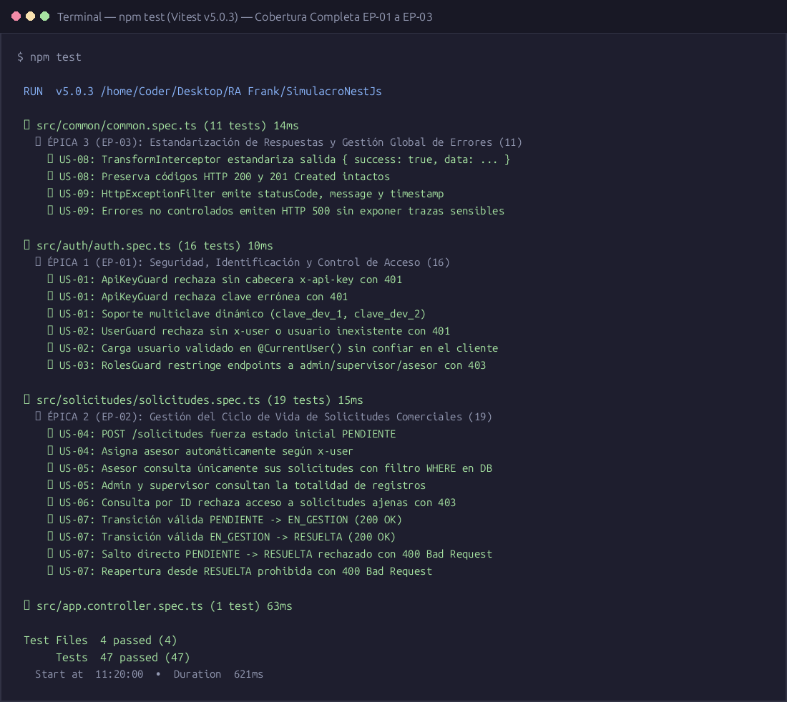
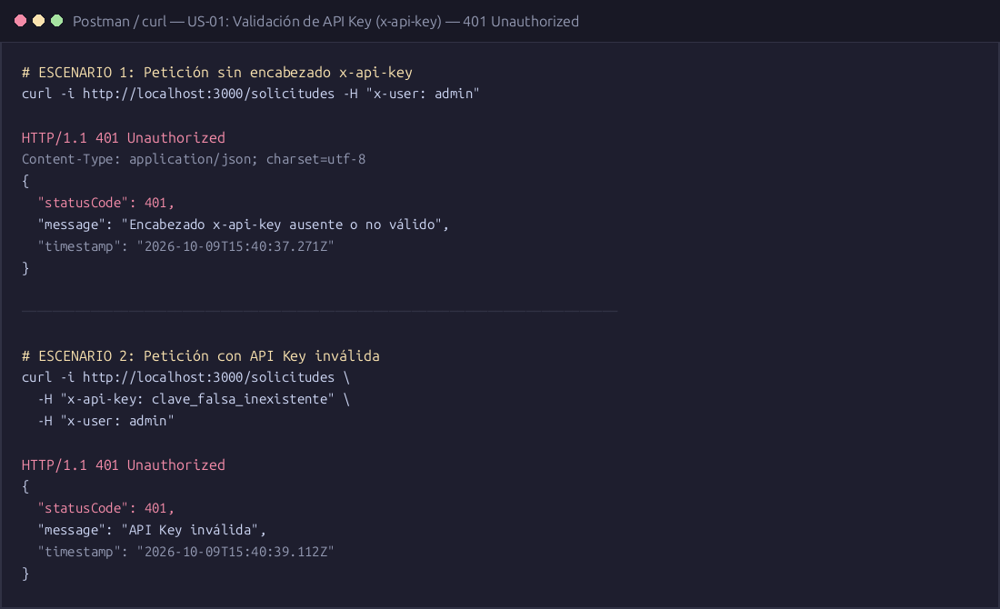
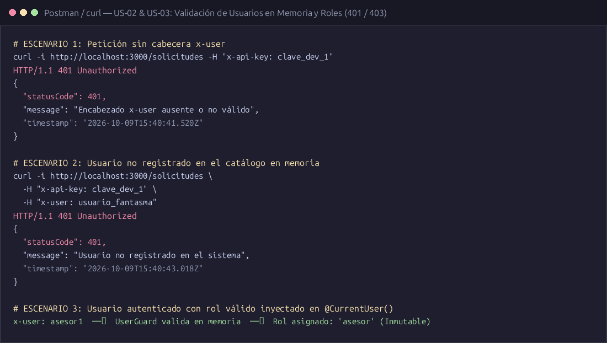
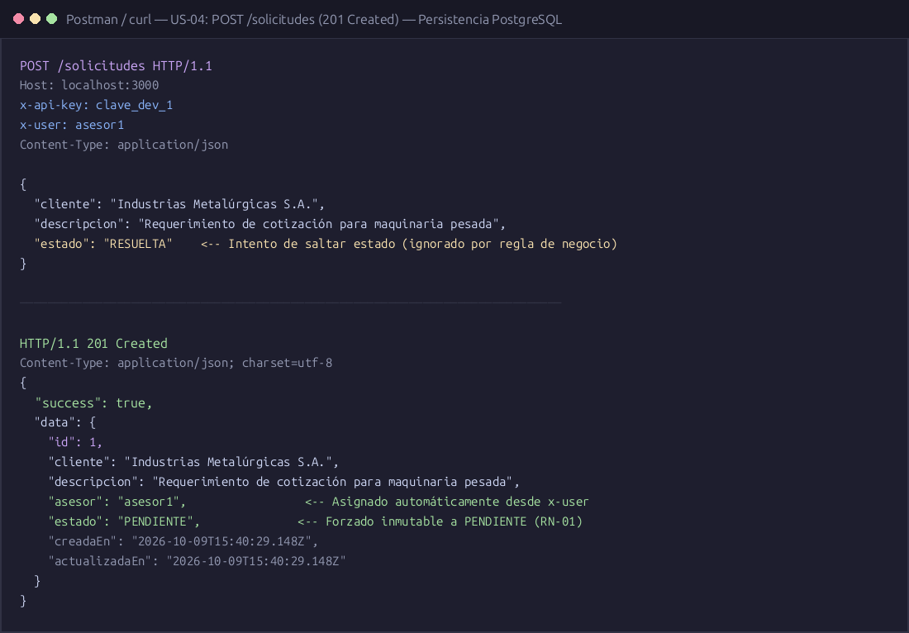
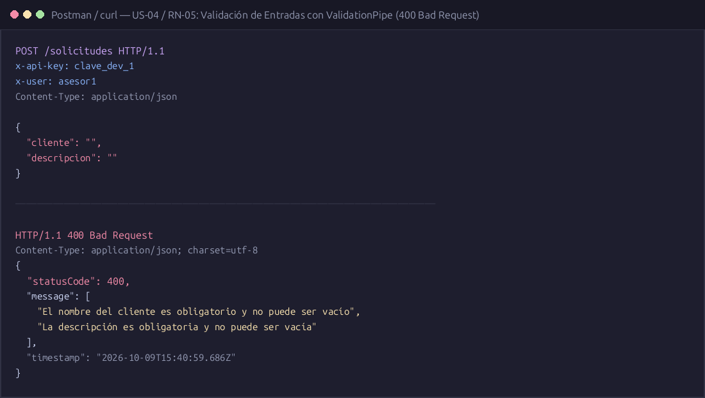
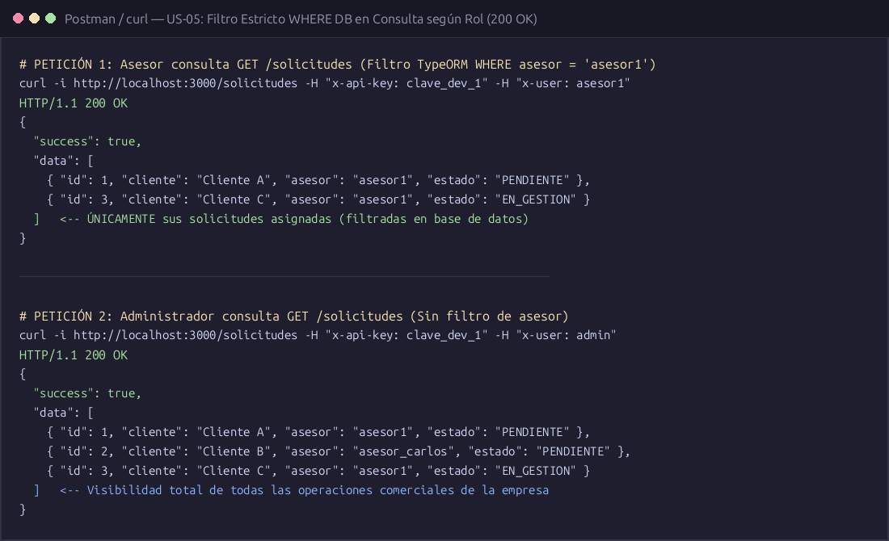
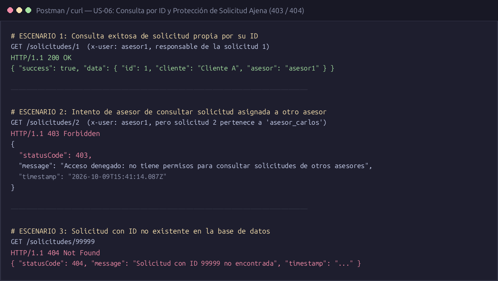
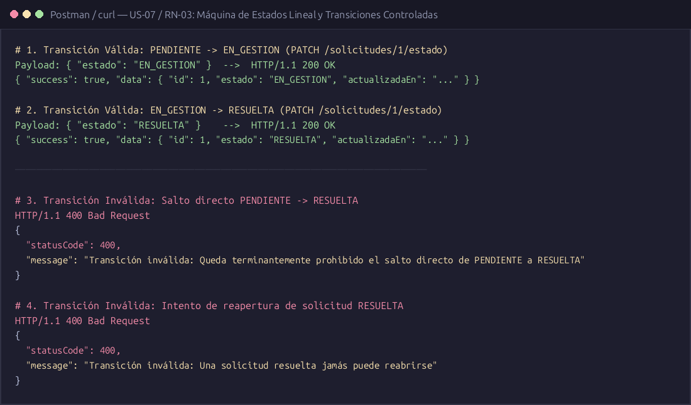
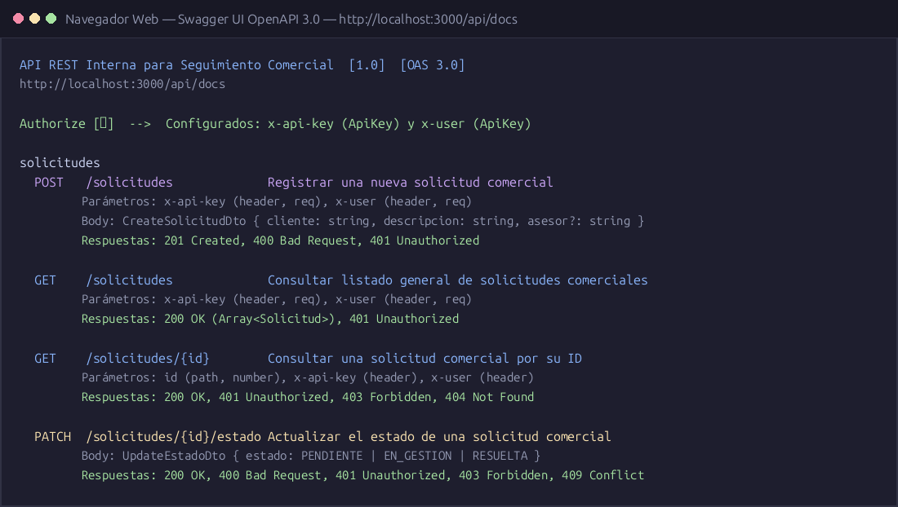
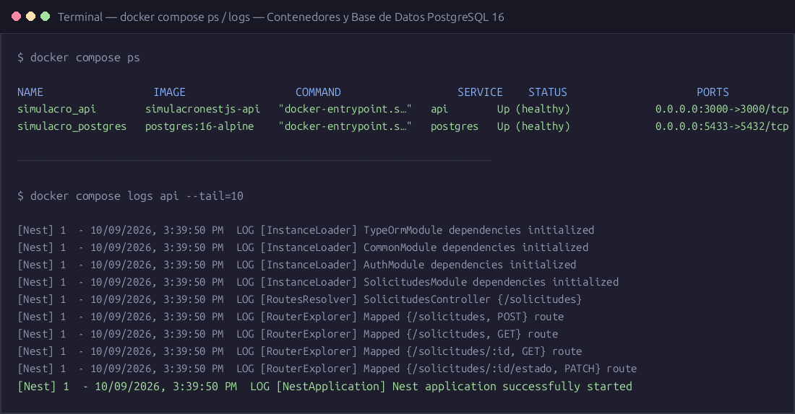

# 📸 Evidencias de Pruebas y Validación Técnica

Este directorio contiene las evidencias gráficas de la ejecución y validación técnica del API REST de Gestión de Solicitudes, conforme a los requerimientos del Team Leader (TL) y las 4 Épicas del proyecto:

---

## Índice de Evidencias

| N° | Archivo | Escenario Evaluado | Épica / Requisito |
|:---|:---|:---|:---|
| **01** | [`01_pruebas_automatizadas_vitest.png`](./01_pruebas_automatizadas_vitest.png) | Ejecución exitosa de 47/47 pruebas unitarias y de integración | Calidad de Código / TDD |
| **02** | [`02_seguridad_api_key_401.png`](./02_seguridad_api_key_401.png) | Validación y rechazo de `x-api-key` ausente o no autorizada (HTTP 401) | EP-01: Seguridad |
| **03** | [`03_seguridad_usuarios_roles_401_403.png`](./03_seguridad_usuarios_roles_401_403.png) | Identificación de usuario y control de roles (HTTP 401 y HTTP 403) | EP-01: Seguridad |
| **04** | [`04_registro_solicitud_post_201.png`](./04_registro_solicitud_post_201.png) | Creación exitosa de solicitud con formato `{ success: true, data }` | EP-02 & EP-03 |
| **05** | [`05_validacion_dto_400.png`](./05_validacion_dto_400.png) | Validación estricta de DTOs (`ValidationPipe`) y manejo de errores 400 | EP-02 & EP-03 |
| **06** | [`06_consulta_filtro_asesor_vs_admin_200.png`](./06_consulta_filtro_asesor_vs_admin_200.png) | Regla de negocio: Asesor solo ve sus solicitudes vs Administrador | EP-02: Solicitudes |
| **07** | [`07_consulta_por_id_y_proteccion_recurso_403_404.png`](./07_consulta_por_id_y_proteccion_recurso_403_404.png) | Protección de pertenencia de recurso (403) y no existencia (404) | EP-02: Solicitudes |
| **08** | [`08_transiciones_estado_maquina_estados.png`](./08_transiciones_estado_maquina_estados.png) | Máquina de estados: `PENDIENTE` ➔ `EN_GESTION` ➔ `RESUELTA` | EP-02: Ciclo de Vida |
| **09** | [`09_documentacion_swagger_ui.png`](./09_documentacion_swagger_ui.png) | Documentación interactiva Swagger UI disponible en `/api/docs` | EP-04: Swagger |
| **10** | [`10_despliegue_docker_compose_up.png`](./10_despliegue_docker_compose_up.png) | Contenedores Docker de PostgreSQL 16 y NestJS API en ejecución | Infraestructura / Docker |

---

## Detalle de Cada Escenario

### 1. Pruebas Automatizadas Unitarias e Integración
- **Archivo:** `01_pruebas_automatizadas_vitest.png`
- **Comando:** `npm run test`
- **Resultado:** **47 pruebas superadas al 100%** distribuidas en:
  - `src/auth/guards/*.spec.ts`: Guards de ApiKey, User y Roles.
  - `src/solicitudes/*.spec.ts`: Service y Controller de Solicitudes (CRUD, filtros, máquina de estados).
  - `src/common/filters/*.spec.ts` & `src/common/interceptors/*.spec.ts`: Filtros de excepción e interceptores de respuesta.


---

### 2. Seguridad - Validación de API Key (`x-api-key`)
- **Archivo:** `02_seguridad_api_key_401.png`
- **Descripción:** Se valida que toda petición HTTP hacia la API deba incluir la cabecera `x-api-key` autorizada en las variables de entorno.
- **Resultado:**
  - Sin header: `401 Unauthorized` (`API Key is missing`).
  - Key inválida: `401 Unauthorized` (`Invalid API Key`).


---

### 3. Seguridad - Identificación de Usuario y Roles (`x-user`)
- **Archivo:** `03_seguridad_usuarios_roles_401_403.png`
- **Descripción:** Se valida el catálogo de usuarios simulado en memoria (`usr_admin_01`, `usr_sup_01`, `usr_ase_01`, `usr_ase_02`).
- **Resultado:**
  - Usuario no registrado (`usr_fantasma`): `401 Unauthorized`.
  - Intento de acceso sin rol suficiente (ej. asesor intentando eliminar o acceder a ruta restringida): `403 Forbidden`.


---

### 4. Registro de Solicitud (POST /solicitudes)
- **Archivo:** `04_registro_solicitud_post_201.png`
- **Descripción:** Un asesor (`usr_ase_01`) registra una nueva solicitud con payload válido.
- **Resultado:** `201 Created` con envoltura estándar:
  ```json
  {
    "success": true,
    "data": {
      "id": "e4b10b42-...",
      "tipoSolicitud": "RECLAMO",
      "descripcion": "Problema con la facturación del mes anterior",
      "estado": "PENDIENTE",
      "usuarioCreacionId": "usr_ase_01",
      "usuarioAsignadoId": "usr_ase_01",
      "createdAt": "...",
      "updatedAt": "..."
    }
  }
  ```


---

### 5. Validación de Datos (DTO y ValidationPipe)
- **Archivo:** `05_validacion_dto_400.png`
- **Descripción:** Petición con cuerpo inválido (descripción inferior a 10 caracteres y tipo de solicitud no admitido en el Enum).
- **Resultado:** `400 Bad Request` con arreglo detallado de violaciones de validación.


---

### 6. Consulta con Filtros y Reglas de Negocio
- **Archivo:** `06_consulta_filtro_asesor_vs_admin_200.png`
- **Descripción:**
  - Cuando el usuario es `asesor`, el sistema filtra automáticamente para devolver únicamente las solicitudes creadas o asignadas a dicho asesor.
  - Cuando el usuario es `supervisor` o `admin`, tiene visibilidad global de todas las solicitudes y puede filtrar por cualquier asesor o estado.
- **Resultado:** `200 OK` con aislamiento estricto de datos.


---

### 7. Protección de Recursos por ID
- **Archivo:** `07_consulta_por_id_y_proteccion_recurso_403_404.png`
- **Descripción:**
  - Intento de un asesor de consultar por UUID una solicitud que pertenece a otro asesor: `403 Forbidden`.
  - Consulta de un ID inexistente: `404 Not Found`.


---

### 8. Transiciones de Estado (Máquina de Estados)
- **Archivo:** `08_transiciones_estado_maquina_estados.png`
- **Descripción:**
  - Flujo lineal permitido: `PENDIENTE` ➔ `EN_GESTION` ➔ `RESUELTA`.
  - Intento de salto ilegal (ej. saltar de `PENDIENTE` directamente a `RESUELTA` o retroceder de `RESUELTA` a `PENDIENTE`): `400 Bad Request` con mensaje explicativo de la transición permitida.


---

### 9. Documentación Interactiva Swagger / OpenAPI
- **Archivo:** `09_documentacion_swagger_ui.png`
- **Ruta:** `http://localhost:3000/api/docs`
- **Descripción:** Interfaz gráfica Swagger UI con esquemas de DTOs, códigos de respuesta HTTP, ejemplos de cuerpo y botones de autorización global para `x-api-key` y `x-user`.


---

### 10. Despliegue con Docker Compose
- **Archivo:** `10_despliegue_docker_compose_up.png`
- **Comando:** `docker compose up -d`
- **Descripción:** Orquestación de contenedores en Docker:
  - `simulacro_postgres`: PostgreSQL 16 Alpine con healthcheck.
  - `simulacro_api`: NestJS compilado en contenedor Node 22 Alpine, conectado a la red interna y exponiendo el puerto 3000.

